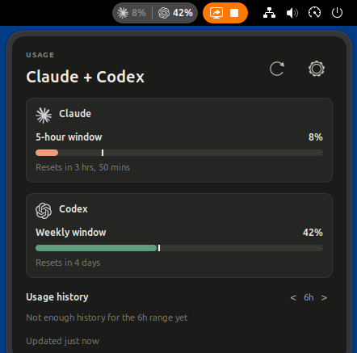
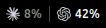
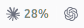
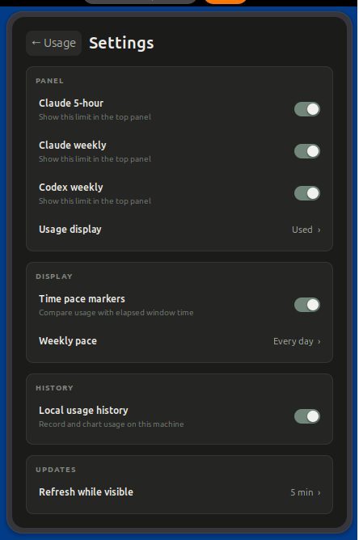
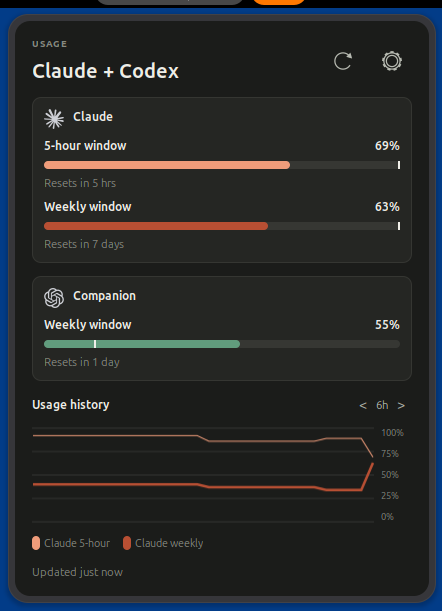

<div align="center">

# Cloudex Usage

**Codex and Claude Code usage limits, at a glance in the GNOME panel.**




</div>

Cloudex Usage is a GNOME Shell extension for people who use both Codex and Claude
Code. It shows current subscription usage while either agent is running, then gets
out of the way when they stop.

## Features

- Codex account-weekly usage from the existing Codex CLI login.
- Claude Code 5-hour and weekly usage from the existing Claude Code OAuth login.
- Used or Left percentages in the panel, popup, and history chart.
- Optional pace markers that compare usage with elapsed time.
- Configurable panel values and a 5, 10, or 15 minute refresh cadence.
- Local-only usage history with ranges from one hour to 30 days.
- Explicit unavailable states instead of stale or guessed values.
- Light and dark GNOME Shell theme support.

Cloudex never starts or authenticates either agent. It reads the existing local
login only while a matching current-user `codex` or `claude` process is present.

## Requirements

- GNOME Shell 50; development and visual validation target GNOME Shell 50.1.
- A file-backed Codex CLI login, a Claude Code OAuth login, or both.
- Node.js and npm to build from source.
- `gnome-extensions` from the GNOME Shell tools.

Keyring-only Codex logins are not currently supported. Configuration paths must also
be visible to GNOME Shell; relative `CODEX_HOME` or `CLAUDE_CONFIG_DIR` values fail
closed.

## Install from source

Clone the repository, install its pinned development dependencies, and build the
production extension:

```bash
git clone https://github.com/HugoJF/cloudex-usage.git
cd cloudex-usage
npm ci
npm run styles

mkdir -p /tmp/cloudex-usage-package
gnome-extensions pack \
  --force \
  --schema=schemas/org.gnome.shell.extensions.cloudex-usage.gschema.xml \
  --extra-source=surface-controller.js \
  --extra-source=panel-preferences.js \
  --extra-source=codex-contract.js \
  --extra-source=codex-runtime.js \
  --extra-source=claude-contract.js \
  --extra-source=claude-runtime.js \
  --extra-source=history-store.js \
  --extra-source=history-runtime.js \
  --extra-source=controller-snapshot.js \
  --extra-source=controller-validation.js \
  --extra-source=panel-view.js \
  --extra-source=history-view.js \
  --extra-source=usage-view.js \
  --extra-source=settings-view.js \
  --extra-source=load-tokens.js \
  --extra-source=temporal.js \
  --extra-source=shared \
  --extra-source=../design/system/tokens.json \
  --extra-source=../design/direction-lab/icons \
  --out-dir=/tmp/cloudex-usage-package \
  extension

gnome-extensions install --force \
  /tmp/cloudex-usage-package/cloudex-usage@hugo.local.shell-extension.zip
```

On Wayland, log out and back in so GNOME Shell loads the installed code. Then enable
the extension:

```bash
gnome-extensions enable cloudex-usage@hugo.local
gnome-extensions info cloudex-usage@hugo.local
```

To uninstall it:

```bash
gnome-extensions uninstall cloudex-usage@hugo.local
```

## Usage and privacy

Start Codex or Claude Code normally. Cloudex appears when it detects the matching
local process and refreshes both eligible providers through one shared cycle. Open
the panel item to see reset times, pace markers, and history; use the gear button to
choose panel values, Used or Left display, cadence, weekly pace, and history options.

Credentials and raw provider responses are never persisted, logged, or displayed.
History contains only timestamps and percentages in a bounded JSON file under the
current user's data directory. Nothing Cloudex records is sent to another service.

The provider usage endpoints are not public APIs and may change. Cloudex validates
their expected shapes strictly and shows usage as unavailable when a response no
longer matches.

## Screenshots

| Panel indicator (dark) | Panel indicator (light) |
| --- | --- |
|  |  |

| Settings | History range control |
| --- | --- |
|  |  |

The [visual evidence index](design/captures/README.md) documents the complete light,
dark, scaling, focus, hover, and unavailable-state capture set.

## Development

Run the complete validation gate:

```bash
npm test
```

It checks documentation, linting, token/CSS drift, unit tests, extension packaging,
isolated GNOME journeys, and temporary capture verification. Useful additional
commands are:

```bash
npm run capture        # regenerate committed screenshots
npm run validate:play  # open the production extension in an isolated devkit window
npm run validate:live  # exercise real local logins in a headless devkit session
```

The live validation commands use existing credentials and make real authenticated
provider requests. The devkit session does not alter extensions installed in the
current desktop session.

Project internals are documented in the [product index](docs/product/README.md),
[architecture](docs/engineering/architecture.md), and
[design system](docs/engineering/design-system.md).

## Trademarks

Claude and Anthropic are trademarks of Anthropic. Codex, OpenAI, and the Blossom mark
are trademarks of OpenAI. This is an independent project, not affiliated with or
endorsed by either company. Provider marks are vendored for local presentation; see
their [provenance](design/direction-lab/icons/README.md).
