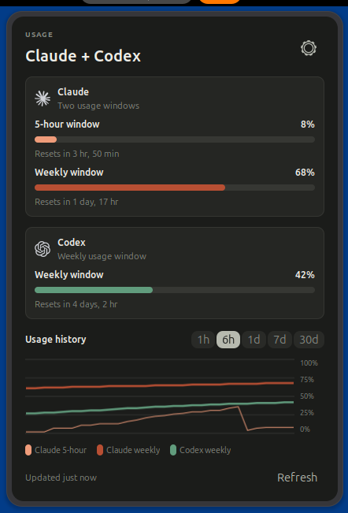
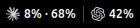
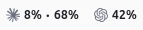
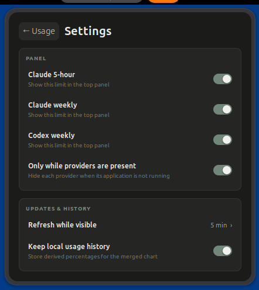
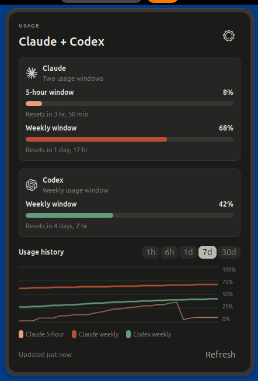

<div align="center">

# Claudex Usage

**Claude Code and Codex usage limits, at a glance in the GNOME panel.**




</div>

## Why

Subscription-backed coding agents run on rolling usage windows, but checking how much
capacity remains means leaving your work to open a separate status view. Claudex Usage
puts those numbers where you already are: while Claude Code or Codex is in use, a small
GNOME Shell indicator shows each provider's current usage windows and reset times —
and when the agents close, it gets out of the way.

## Principles

These constraints are product-level commitments, not implementation details
(canonical in the [product pitch](docs/product/pitch.md)):

- **One surface, per-provider adapters.** A single panel experience covers both
  providers.
- **Opportunistic visibility.** An indicator appears only while its matching
  application is active — no permanent background monitoring obligation.
- **Never wake an agent to watch it.** Codex is only attached to an already-running
  app-server; nothing is started solely to obtain usage.
- **Privacy by default.** Credentials and raw provider responses are never persisted,
  logged, or displayed, and nothing is shared with another service.
- **Fail closed.** An outage, expired session, or unavailable server produces an
  explicit unavailable state — never a stale or misleading value.

## Project status

The project is in its design phase. The approved visual system ships today as an
installable static primitive catalog; live provider integration is the next milestone.

| Capability | Status |
| --- | --- |
| Design system and primitive catalog | ✅ Done — Direction D, installable with a screenshot harness |
| Unified usage surface | 🔜 Planned |
| Claude Code / Codex provider adapters | 🔜 Planned |

The [feature horizon](docs/product/feature-horizon.md) tracks the full capability map.

## Gallery

Every state is captured deterministically from an isolated GNOME Shell 50.1 session by
the J-001 journey — light and dark Shell chrome, focus and hover states, and 200%
panel scaling.

| Panel indicator (dark) | Panel indicator (light) |
| --- | --- |
|  |  |

| Settings popover | Range focus & hover |
| --- | --- |
|  |  |

The complete evidence set lives in [`design/captures`](design/captures/README.md).

## Preview without installing

Launch the catalog in an isolated GNOME Shell devkit session:

```bash
npm run capture
```

The devkit uses a disposable home and does not change the extensions installed in
the current desktop session.

## Install for development

The catalog currently supports GNOME Shell 50. Run these commands from the project
root to build and install it for the current user; `sudo` is not required.

```bash
npm run styles
mkdir -p /tmp/claudex-usage-package

gnome-extensions pack \
  --force \
  --extra-source=icons \
  --extra-source=catalog-state.js \
  --extra-source=primitives.js \
  --extra-source=../system/tokens.json \
  --out-dir=/tmp/claudex-usage-package \
  design/direction-lab

gnome-extensions install --force \
  /tmp/claudex-usage-package/claudex-usage-design@hugo.local.shell-extension.zip
```

On Wayland, log out and back in so GNOME Shell loads the newly installed code, then
enable the catalog and verify its status:

```bash
gnome-extensions enable claudex-usage-design@hugo.local
gnome-extensions info claudex-usage-design@hugo.local
```

To install an updated development build, repeat the pack and install commands, then
log out and back in. To remove the catalog:

```bash
gnome-extensions uninstall claudex-usage-design@hugo.local
```

This installs the static design catalog only. Claude and Codex provider integration
has not been implemented yet.

## Development

One command is the entire validation gate — docs, token/CSS drift, unit tests,
extension packaging, and the isolated J-001 GNOME journey with capture verification:

```bash
npm test
```

Use `npm run capture` only when the canonical screenshots must be regenerated.

The project follows the [Aura workflow](AGENTS.md): work descends from an accepted
spec, docs are the source of truth, and every slice closes through the same gate.

## Documentation

| Document | Purpose |
| --- | --- |
| [Product pitch](docs/product/pitch.md) | Problem, promise, and provider constraints |
| [Product index](docs/product/README.md) | Every brief and spec with one-line status |
| [Feature horizon](docs/product/feature-horizon.md) | Capability maturity and parking lot |
| [Architecture](docs/engineering/architecture.md) | Catalog topology and boundaries |
| [Design system](docs/engineering/design-system.md) | Tokens, primitives, interaction idioms |
| [Primitive catalog](design/direction-lab/README.md) | The installable Direction D catalog |
| [Visual evidence](design/captures/README.md) | Canonical J-001 captures |

## Trademarks

Claude and Anthropic are trademarks of Anthropic. Codex, OpenAI, and the Blossom mark
are trademarks of OpenAI. This is an independent project, not affiliated with or
endorsed by either company; provider marks are vendored for the local design review
only (see [provider mark provenance](design/direction-lab/icons/README.md)).
